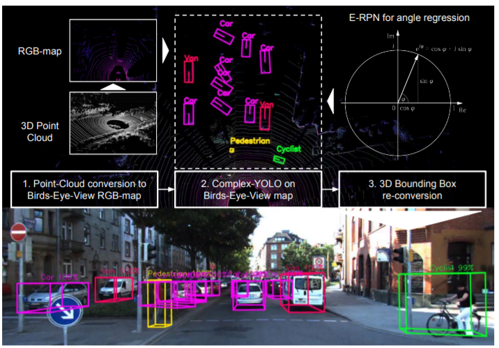

# Complex YOLOv4

[![python-image]][python-url]
[![pytorch-image]][pytorch-url]

The PyTorch Implementation with YOLOv4 of the paper: [Complex-YOLO: Real-time 3D Object Detection on Point Clouds](https://arxiv.org/pdf/1803.06199.pdf)

---

## Demo


## Features
- [x] [Distributed Data Parallel Training](https://github.com/pytorch/examples/tree/master/distributed/ddp)
- [x] TensorboardX

## 2. Getting Started
### Requirement

```shell script
pip install -U -r requirements.txt
```

### Data Preparation
Download the 3D KITTI detection dataset from [here](http://www.cvlibs.net/datasets/kitti/eval_object.php?obj_benchmark=3d).

The downloaded data includes:

- Velodyne point clouds **(29 GB)**: input data to VoxelNet
- Training labels of object data set **(5 MB)**: input label to VoxelNet
- Camera calibration matrices of object data set **(16 MB)**: for visualization of predictions
- Left color images of object data set **(12 GB)**: for visualization of predictions

### Complex-YOLO architecture



### How to run

#### Inference

```shell script
python test.py --gpu_idx 0
```

#### Training

##### 2.3.1.1. Single machine, single gpu

```shell script
python train.py --gpu_idx 0
```

##### 2.3.1.2. Multi-processing Distributed Data Parallel Training
We should always use the `nccl` backend for multi-processing distributed training since it currently provides the best 
distributed training performance.

- **Single machine (node), multiple GPUs**

```shell script
python train.py --dist-url 'tcp://127.0.0.1:29500' --dist-backend 'nccl' --multiprocessing-distributed --world-size 1 --rank 0
```

- **Two machines (two nodes), multiple GPUs**

_**First machine**_

```shell script
python train.py --dist-url 'tcp://IP_OF_NODE1:FREEPORT' --dist-backend 'nccl' --multiprocessing-distributed --world-size 2 --rank 0
```
_**Second machine**_

```shell script
python train.py --dist-url 'tcp://IP_OF_NODE2:FREEPORT' --dist-backend 'nccl' --multiprocessing-distributed --world-size 2 --rank 1
```

To reproduce the results, you can run the bash shell script

```bash
./train.sh
```

## Source code structure

```
├── README.md    
└── dataset/    
    └──kitti
        ├── training
        |   ├── image_2 <-- for visualization
        |   ├── calib
        |   ├── label_2
        |   ├── velodyne
        └── testing  
        |   ├── image_2 <-- for visualization
        |   ├── calib
        |   ├── velodyne 
└──src/
    └──config/
    └──data_process/
    └──models/
    └──utils/
    └──test.py
    └──train.py
    └──train.sh
```


[python-image]: https://img.shields.io/badge/Python-3.x-ff69b4.svg
[python-url]: https://www.python.org/
[pytorch-image]: https://img.shields.io/badge/PyTorch-1.5-2BAF2B.svg
[pytorch-url]: https://pytorch.org/